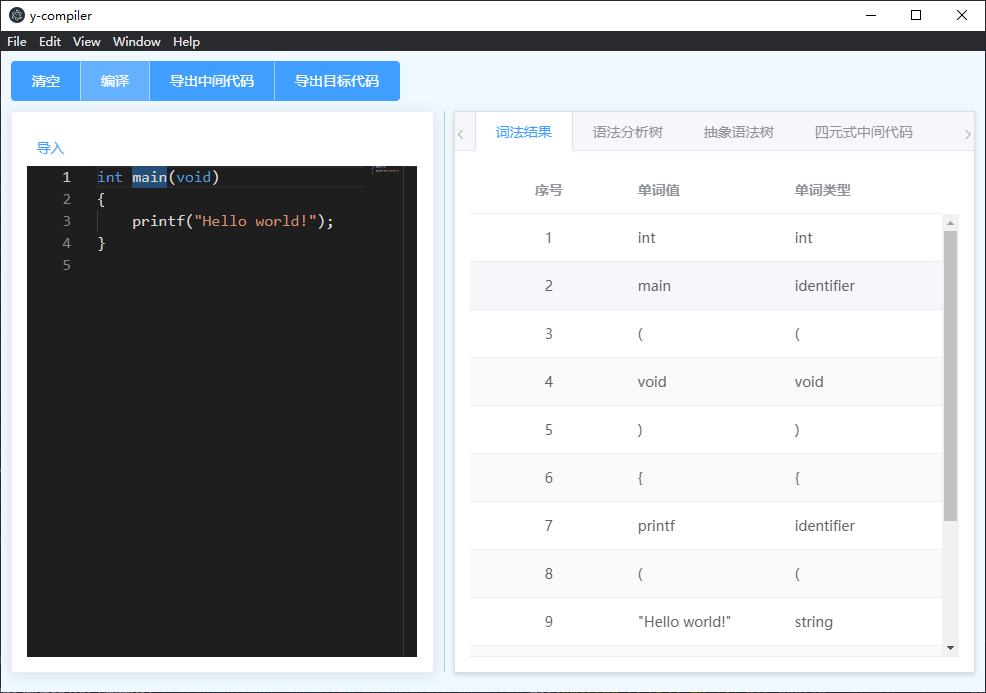
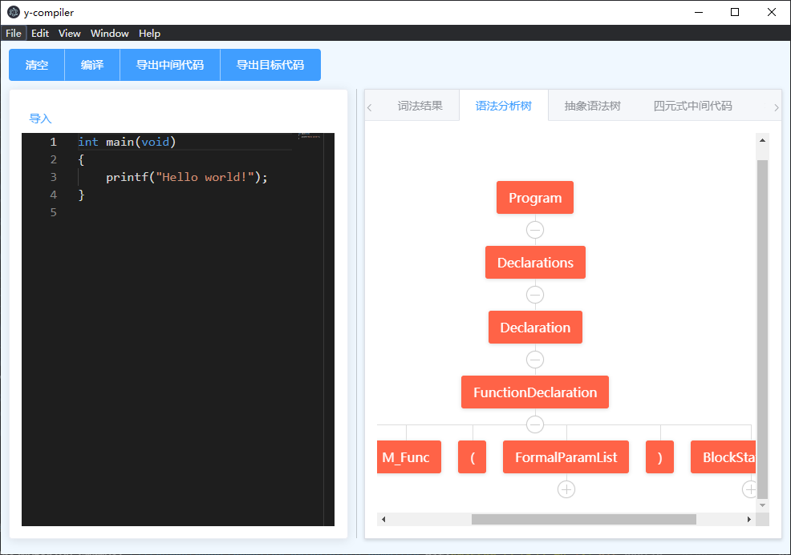
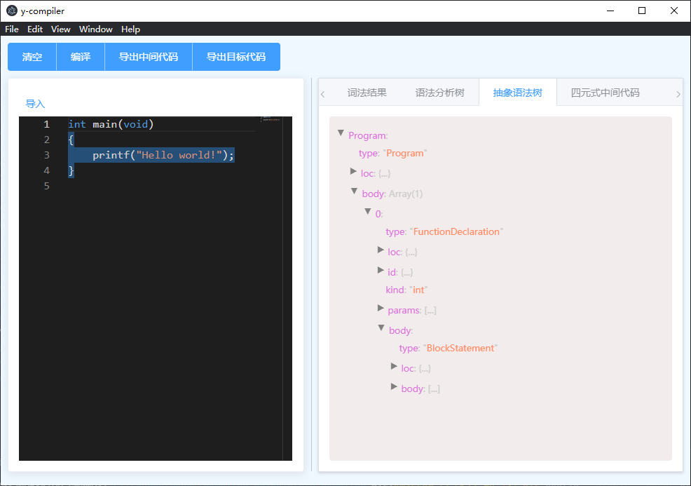
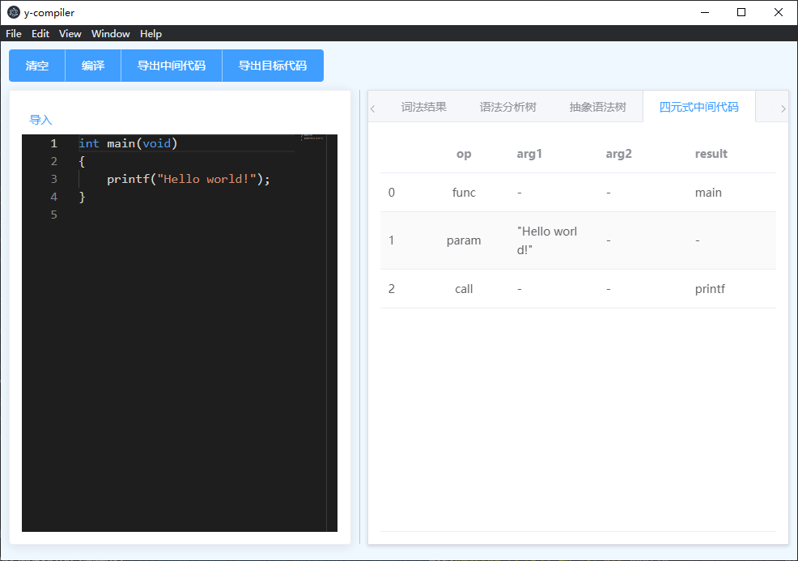
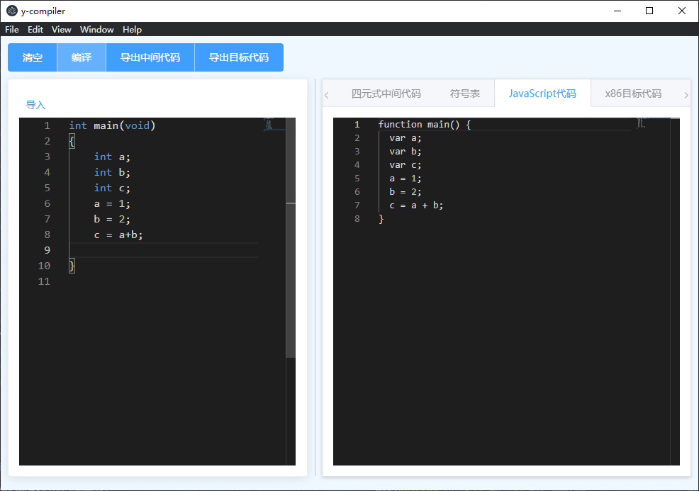
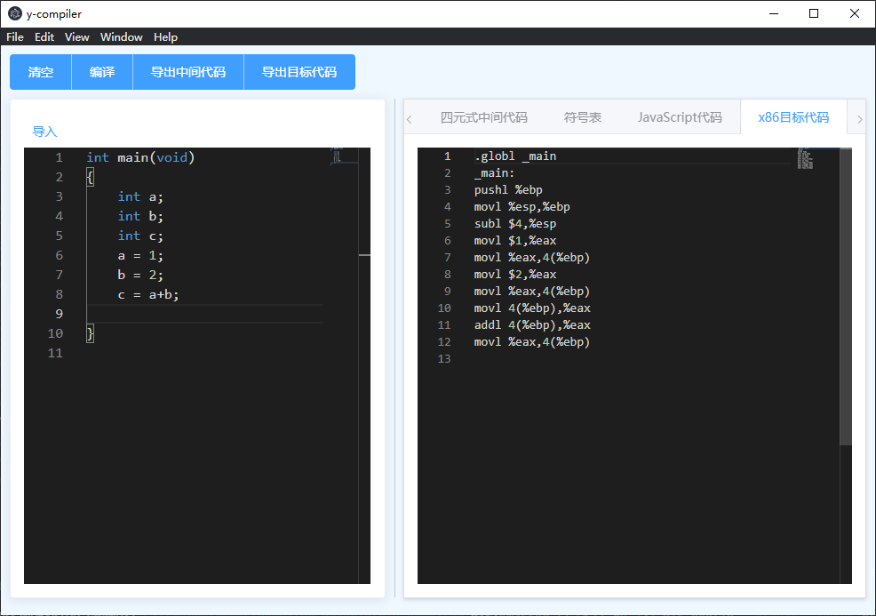

# `y-compiler` 编译原理课程设计

## 简介
该项目是编译原理的课程设计，基于node.js、vue.js、Element UI进行构建，实现了将类C语言编译为x86汇编代码的功能。

## 完成功能
- 词法分析
- 语法分析
- 具体语法树构建及可视化
- 抽象语法树构建及可视化
- 四元式中间代码生成
- x86目标代码生成

## 展示
### 词法分析
- 鼠标悬停某个token，编辑器对应位置高亮显示

### 语法分析树
- 使用vue的树形可视化组件进行可视化

### 抽象语法树
- 仿造JavaScript的Acron抽象语法树进行构造
- 鼠标悬停某个语法树节点，编辑器对应位置高亮

### 中间代码
- 四元式中间代码

### 转JS代码
- 利用Acron抽象语法树和Babel进行语言转换

### 目标代码
- 生成AT&T风格的x86汇编代码
- 可用GCC直接编译为windows平台下可执行文件

